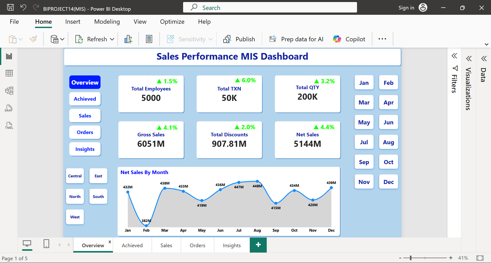
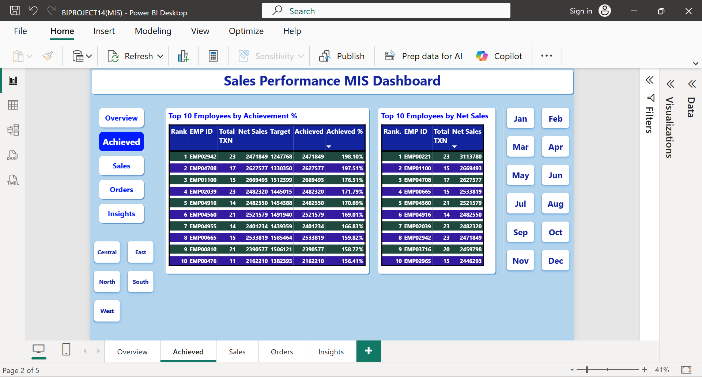
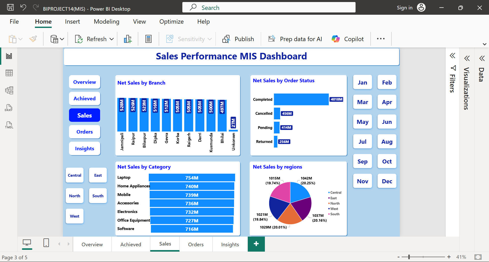
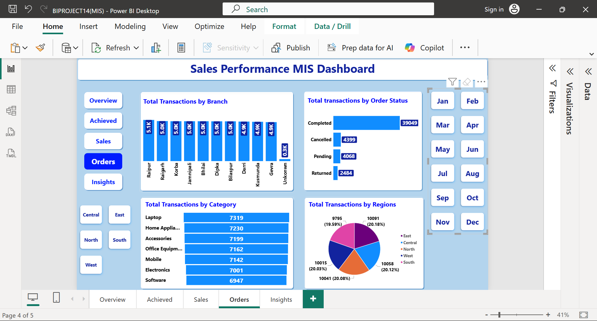
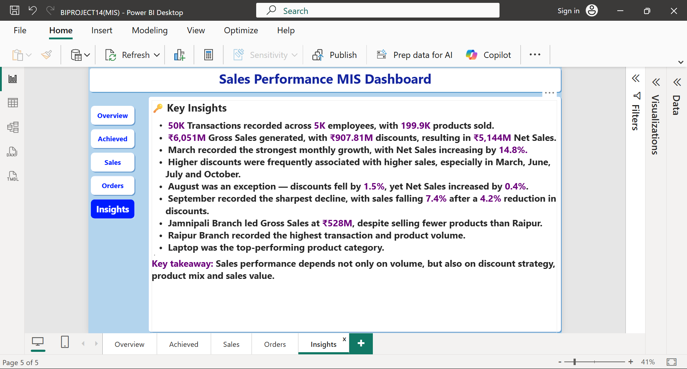

# 📊 Sales Performance MIS Dashboard

An interactive Sales Performance MIS Dashboard developed using Advanced Excel and Power BI to transform raw and messy sales data into meaningful business insights.

This project demonstrates the complete workflow from raw data cleaning and preparation to data modeling, KPI development, interactive analysis and management insights.

---

## 🎯 Project Overview

The objective of this project is to analyze annual sales performance across employees, branches, regions, product categories and order status.

The project starts with raw and unstructured data and converts it into a professional interactive MIS dashboard.

## 🔄 Project Workflow

Raw / Messy Data → Data Cleaning → Monthly Targets → Employee Master → Data Modeling → Power BI Dashboard → Management Insights

---

## 🛠️ Tools & Technologies

- 🟢 Microsoft Excel
- 🔵 Power Query
- 🟡 Power BI
- 🟣 DAX
- 📊 Data Modeling
- 📈 MIS Reporting

---

## 🧹 Data Preparation

The project includes practical data-cleaning and preparation activities such as:

- Removing duplicate records
- Handling missing values
- Standardizing text and names
- Cleaning date formats
- Correcting inconsistent values
- Preparing employee master data
- Preparing employee-wise monthly targets
- Creating a proper Date Table
- Preparing data for Power BI analysis

---

# 📊 Dashboard Pages

## 1️⃣ Overview

The Overview page provides a high-level summary of sales performance through key KPIs and monthly trends.

Key KPIs include:

- Total Employees
- Total Transactions
- Total Quantity
- Gross Sales
- Total Discounts
- Net Sales
- Monthly Net Sales
- Month-on-Month (MoM) Growth

---

## 2️⃣ Employee Achievement

The Achieved page focuses on employee performance and achievement against monthly targets.

Key analysis includes:

- Top 10 Employees by Achievement %
- Top 10 Employees by Net Sales
- Employee-wise Transactions
- Employee-wise Net Sales
- Employee Target
- Achievement %
- Employee Ranking

---

## 3️⃣ Sales Analysis

The Sales page provides detailed sales analysis across different business dimensions.

Analysis includes:

- Branch-wise Net Sales
- Region-wise Net Sales
- Product Category-wise Net Sales
- Order Status-wise Net Sales

Interactive slicers allow the user to change the selected month and explore the data dynamically.

---

## 4️⃣ Orders Analysis

The Orders page focuses on transaction volume and order analysis.

Analysis includes:

- Transactions by Branch
- Transactions by Region
- Transactions by Product Category
- Transactions by Order Status

---

## 5️⃣ Management Insights

The Insights page summarizes important findings from the annual sales data.

It highlights:

- Monthly sales trends
- Sales growth and decline
- Discount patterns
- Branch performance
- Transaction volume
- Product performance
- Regional performance
- Key management takeaways

---

## 📈 Key Features

- 📅 Month-wise interactive analysis
- 🌎 Region-wise filtering
- 🏢 Branch-wise analysis
- 👨‍💼 Employee performance tracking
- 🎯 Employee-wise monthly target comparison
- 📊 Achievement % calculation
- 📈 MoM sales growth analysis
- 🛒 Order and transaction analysis
- 💰 Gross Sales, Discount and Net Sales analysis
- 💡 Management-level insights
- 🔄 Interactive Power BI slicers

---

## 📐 Important DAX Measures

Actual Sales

Actual Sales = SUM('Clean Sheet'[Net_Sales])

Target

Target = SUM('Target'[Monthly_Target])

Variance

Variance = [Actual Sales] - [Target]

Achievement %

Achievement % = DIVIDE([Actual Sales], [Target], 0)

---

## 📥 Download

- [📊 Power BI Dashboard](./BIPROJECT(MIS).pbix)

---

## 🎥 Project Walkthrough

I also created a complete screen-recorded walkthrough of this project covering:

Title Card → Raw/Messy Data → Data Cleaning → Monthly Targets → Employee Master → Power BI Data Modeling → Overview → MoM Analysis → Slicers → Employee Achievement → Sales Analysis → Orders Analysis → Management Insights → Tools

## 📌 LinkedIn Project Post:
"View Project on LinkedIn" (https://www.linkedin.com/)

---

## 🌐 Portfolio

Visit my portfolio:
"Pradeep Kumar Kurrey – Portfolio" (https://pradeepkurrey.github.io/My-Website/)

---

## 👨‍💼 About Me

I am an Advanced Excel & MIS Executive focused on building practical solutions using:

- Advanced Excel
- Excel Automation
- MIS Reporting
- Payroll Automation
- Power Query
- Power BI
- DAX
- Dashboard Development

---

## 📬 Connect With Me

- 🌐 Portfolio: "My Portfolio" (https://pradeepkurrey.github.io/My-Website/)
- 💼 LinkedIn: "My LinkedIn Profile" (https://www.linkedin.com/in/pradeep-kurrey-data-analyst)
- 🐙 GitHub: "My GitHub Profile" (https://github.com/pradeepkurrey)

---

⭐ If you find this project useful, feel free to explore the repository and connect with me.
